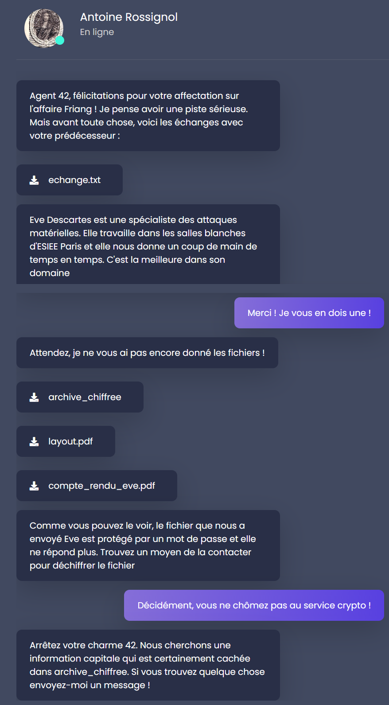
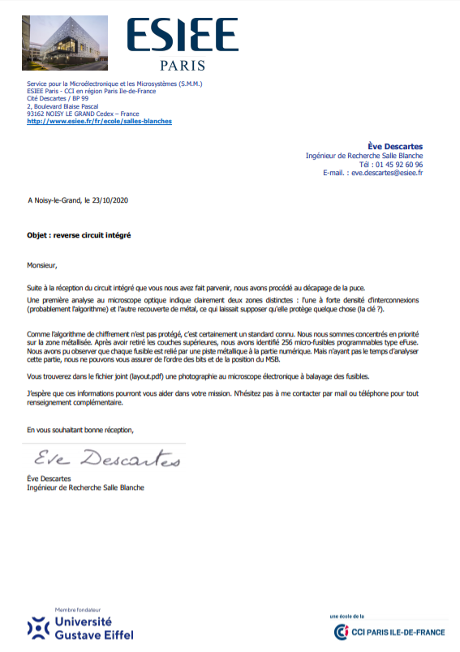
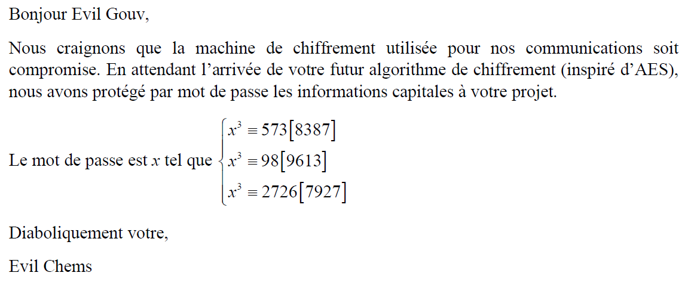
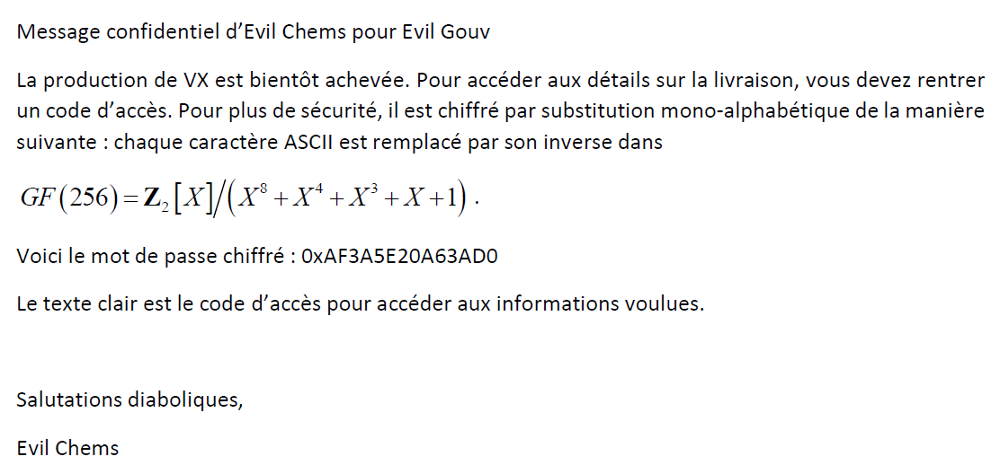
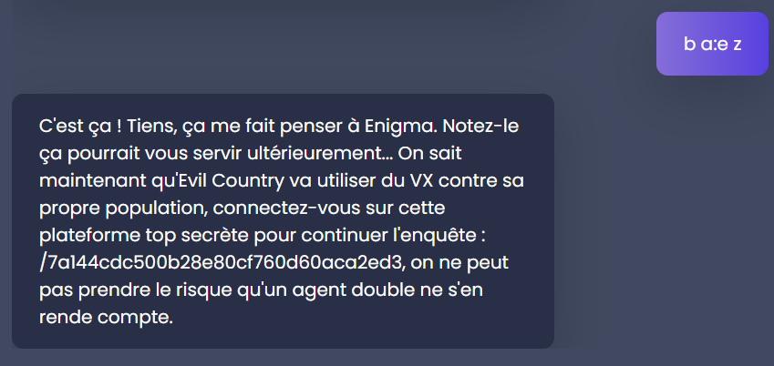

# Antoine Rossignol - challenge de cryptographie

Le challenge de cryptographie est introduit par Antoine Rossignol. 



Le fichier `echange.txt` est le suivant:

> Antoine Rossignol 29/09/2020 : "Un des nos agents a intercepté du matériel de chiffrement et un message chiffré émis par Evil Chems qui doit contenir des informations capitales sur la livraison de produits chimiques."
>
> Agent 40 30/09/2020 : "OK, on s'occupe de démonter le matériel pour analyse."
>
> Agent 40 08/10/2020 : "C'est plus compliqué que prévu! Le processeur ne fait qu'échanger des données avec un circuit intégré dédié (ASIC). On suppose qu'il contient l'algorithme de chiffrement et que la clé y est stockée en dur."
>
> Antoine Rossignol 08/10/2020 : " Envoyez en urgence l'ASIC à Eve Descartes d'ESIEE-Paris pour une rétro-conception matérielle"
>
> Agent 40 12/10/2020 : "Eve Descartes a bien reçu le circuit. Elle s'en occupe en priorité."
>
> Antoine Rossignol 23/10/2020 : "Voici le compte-rendu d'Eve avec la cartographie de la zone étudiée. Il devient urgent de déchiffrer le message."

Le fichier `archive_chiffree` contient des données non exploitables actuellement.

`layout.pdf` ne s'ouvre qu'avec un mot de passe.

Enfin, `compte_rendu_eve.pdf` s'ouvre et donne le document suivant:



## Décodage de l'archive chiffrée

En lisant le texte et le pdf, on comprend que le message secret a été chiffré à l'aide d'une ASIC. L'algorithme est un standard connu, et la clé est rentrée en dur dans la carte électronique et est décrite dans le fichier `layout.pdf`. Elle est composée de 256 bits (un bit par microfusible).

Sachant qu'il s'agit d'un standard connu avec une clé de 256 bits, nous penchons pour AES. Il s'agit d'une crypto hardware donc le mode d'opération est probablement ECB.

L'objectif est donc d'ouvrir le fichier `layout.pdf` afin d'obtenir la clé. A plusieurs reprises, il est conseillé d'essayer de contacter Eve Descartes. Ses coordonnées sont données dans son compte rendu.

En la contactant par téléphone, on tombe sur la messagerie qui contient un message en morse. Il est assez court, donc on le décrypte à la main et on obtient le mot de passe du pdf: `resistance`. Le pdf contient la photo suivante:


On obtient effectivement 256 bits, avec un circuit ouvert représentant 0 et un circuit fermé représentant un 1.

Malheureusement, Eve Descartes admet avoir deux incertitudes:

> Mais n’ayant pas le temps d’analyser cette partie, nous ne pouvons vous assurer de l’ordre des bits et de la position du MSB.


Cela signifie qu'elle ne sait pas dans quel sens lire les bits (vertical ou horizontal et sens de lecture) ni où se trouve le bit de poids fort (MSB), ie dans quel sens lire les bits.

Cela ne donne que 8 possibilités, donc nous les essayons toutes grâce au script Python suivant:

```python
from Crypto.Cipher import AES
from Crypto.Util.Padding import unpad

key = ["1011111010111010", "1010110011011111", "1100110111001010", "1100100111011111", "1011101010111100", "1011110111011111", "1101111111011111", "1101111111011111", "1101111111011111", "1101111111011111", "1101111111011111", "1101111111011111", "1101111111011111", "1101111111011111", "1101111111011111", "1101111111011111"]

with open("archive_chiffree", "rb") as f:
    ctxt = f.read()

real_key = 0
i = 0
for j in range(16):
    for k in range(16):
        # Test de toutes possibilités: 
        # Changer 15-j <=> j ou 15-k <=> k ou j <=> k
        real_key += ((1 - int(key[15-j][15-k])) << i)
        i += 1

key = real_key.to_bytes(32, byteorder='big')
print(key)

cipher = AES.new(key, AES.MODE_ECB)
ptxt = cipher.decrypt(ctxt)

with open('sol', 'wb') as f:
    f.write(ptxt)

```

L'ordre donné dans le script permet d'obtenir la clé `AES 256 ECB` ce qui confirme l'algorithme utilisé. 

Le fichier obtenu est une archive ZIP.

## Trouver le mot de passe du PDF (encore)

Le fichier ZIP contient deux fichiers PDF, dont l'un est protégé par mot de passe.

L'autre fichier contient l'information suivante:



Il s'agit d'une équation linéare de degré 1 en `x^3`. Les moduli sont premiers (donc premiers entre eux), par conséquent le [CRT](https://fr.wikipedia.org/wiki/Th%C3%A9or%C3%A8me_des_restes_chinois) (ou théorème des restes chinois) permet de trouver une solution.

Puis on bruteforce la solution pour la racine cubique.

```python
# Code pour le CRT trouvé sur internet: https://rosettacode.org/wiki/Chinese_remainder_theorem#Python_3.6
from functools import reduce
def chinese_remainder(n, a):
    sum = 0
    prod = reduce(lambda a, b: a*b, n)
    for n_i, a_i in zip(n, a):
        p = prod // n_i
        sum += a_i * mul_inv(p, n_i) * p
    return sum % prod

def mul_inv(a, b):
    b0 = b
    x0, x1 = 0, 1
    if b == 1: return 1
    while a > 1:
        q = a // b
        a, b = b, a%b
        x0, x1 = x1 - q * x0, x0
    if x1 < 0: x1 += b0
    return x1
 
def bf_root(a,n):
    for i in range(n):
        if pow(i, 3, n) == a:
            return i
 
if __name__ == '__main__':
    n = [8387, 9613, 7927]
    a = [573, 98, 2726]
    y = chinese_remainder(n,a)
    x = bf_root(y, n[0]*n[1]*n[2])
    print(x)
```

On trouve finalement `x = 5622`, ce qui permet d'ouvrir le PDF.

Note: j'ai initialement trouvé une autre solution qui vérifie l'équation, le problème est donc mal posé... 
En effet, si je résoud d'abord les racines cubiques puis le système j'obtiens 356520355104 qui est une réponse valide au système d'équations mais n'est pas le mot de passe du pdf...

## Trouver le code d'accès

Le PDF dont nous venons de trouver le mot de passe contient le document suivant:



Il s'agit d'inverser chaque caractère ASCII dans le corps de Galois GF(256) donné. La librairie Python `pyfinite` permet d'effectuer très simplement des opérations dans les corps de Galois, le script Python trouve ainsi le mot de passe.

```python
from pyfinite import ffield
# GF(2^8) avec polynome X^8 + X^4 + X^3 + X + 1
F = ffield.FField(8, gen=0b100011011)
cipher = bytes.fromhex("AF3A5E20A63AD0")

ptxt = []
for i in cipher:
    ptxt.append(F.Inverse(i))

print(bytes(ptxt))
```
On obtient donc le code d'accès `b a:e z`.




Aller à l'url indiquée nous redirige vers la plateforme du CTF.