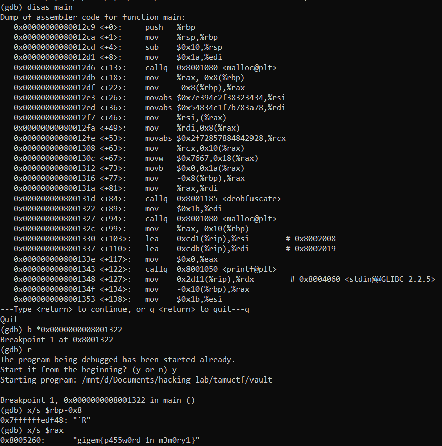

# Vault

## Description

A binary is given

## Solution

Let's reverse the code using [Ghidra](https://ghidra-sre.org/).

```c
undefined8 main(void)
{
  int iVar1;
  undefined8 *__s1;
  char *__s;
  
  __s1 = (undefined8 *)malloc(0x1a);
  *__s1 = 0x7e394c2f38323434;
  __s1[1] = 0x54834c1f7b783a78;
  __s1[2] = 0x2f72857884842928;
  *(undefined2 *)(__s1 + 3) = 0x7667;
  *(undefined *)((long)__s1 + 0x1a) = 0;
  deobfuscate(__s1);
  __s = (char *)malloc(0x1b);
  printf("%s","Enter password: ");
  fgets(__s,0x1b,stdin);
  iVar1 = strcmp((char *)__s1,__s);
  if (iVar1 == 0) {
    puts("Correct!  That\'s the password!");
  }
  else {
    puts("Sorry, that isn\'t the right password.");
  }
  return 0;
}
```

So we have an hex string defined in `__s1`, then it is deobfuscated with the deobfuscate method. Then we need to enter the deobfuscated string. Instead of trying to reverse the method, I can just use GDB to call the method, and show the string.



Launching GDB with `gdb vault`, I disassemble the main function (`disas main`) and set a breakpoint after the deobfuscate function (`b* 0x...`). Then I run the program (`r`) and when the breakpoint is reached, I just show the content of `__s1` (which address is currently in the `rax` register): `x/s $rax`.

Flag: `gigem{p455w0rd_1n_m3m0ry1}`